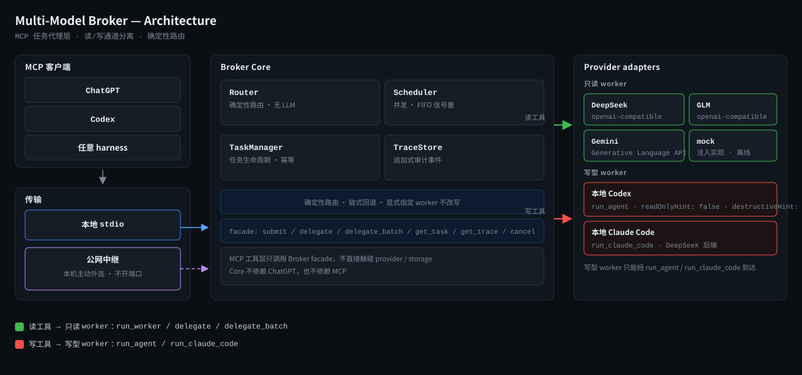

# Multi-Model Broker

[](https://github.com/Bowen-studying/multimodel-broker/actions/workflows/ci.yml)
[](LICENSE)


**中文** · [English](README.en.md)

面向 MCP 的多模型任务代理层（broker）：MCP 客户端（ChatGPT、Codex 或任何 harness）把任务交给它，它按能力路由（router）到本机或云端的多个 worker（本地 Codex、本地 Claude Code、DeepSeek、GLM、Gemini、mock），返回统一结构的结果，并留下可审计的 trace。读/写能力严格分离，写型 worker 只能经各自的写工具到达。

## 特性

- 两种 MCP 传输：stdio（本地 harness）与 Streamable HTTP（回环 + 共享密钥，可选 SSE 应答）
- 三种 profile（7 / 9 / 8 个工具）、10 个注册工具，读/写严格分离：写型 worker 只能经 `run_agent` / `run_claude_code` 到达
- 确定性路由：按 requirements（coding / long_context / low_cost / chinese / batch 等）+ 能力声明选择 worker，链式回退；显式指定 worker 永不被改写
- 长任务、并发、幂等与审计：`delegate_batch` 一次最多 8 个任务并行，部分失败也保留结果；`idempotencyKey` 去重防二次计费；trace 默认不落 prompt 原文
- 公网可达但不开端口：`relay` 让本机主动外连自建中继，远程客户端经固定 URL 访问

## 为什么做这个

把多个模型接到同一个 MCP 接口后面：supervisor（如 ChatGPT Pro）只负责规划与复核，broker 负责把任务路由到最合适的 worker，并处理并发、追踪与审计。每个 provider 只需实现一次适配（adapter），接入侧换 transport（stdio / HTTP / 中继）即可；读路径与写路径的凭据和工具面严格分开，写文件这类有副作用的操作不会被藏进"只读"工具里。

## 架构



```text
┌──────────────────────────────────────────────────────────┐
│  MCP 客户端（ChatGPT / Codex / 任意 harness）              │
└──────────────────────────┬───────────────────────────────┘
                           │ MCP（stdio / Streamable HTTP / relay）
                           ▼
┌──────────────────────────────────────────────────────────┐
│  MCP 接口层        src/interfaces/mcp                     │
│  tools · schemas · profiles · annotations · http · server │
└──────────────────────────┬───────────────────────────────┘
                           │ 只调用 Broker，不直接接触 provider
                           ▼
┌──────────────────────────────────────────────────────────┐
│  Broker Core       src/core                               │
│  broker · router · scheduler · task-manager · trace-store │
│  policy · config                                          │
└──────────────────────────┬───────────────────────────────┘
                           │ 统一的 WorkerRequest / WorkerResult
                           ▼
┌──────────────────────────────────────────────────────────┐
│  Provider 适配层    src/providers                          │
│  mock · openai-compatible(DeepSeek/GLM) · gemini          │
│  codex · claude-code                                      │
└──────────────────────────────────────────────────────────┘
```

分层：Core 不认识 ChatGPT，provider 不认识 MCP。broker 前面的 transport 是可替换的（今天是 stdio，明天可以是远程 MCP 端点或 harness 插件）；provider 只认统一的请求/结果结构，不感知自己正被哪个 MCP 客户端驱动。

## 技术栈与要求

- Node.js >= 22.5（用内置 `node:sqlite`），TypeScript，零原生模块、无需构建工具链
- 依赖：`@modelcontextprotocol/sdk` ^1.30、`zod` ^4.6、`yaml` ^2.9
- 测试：263 个测试 / 33 个文件（vitest），全部离线，不花任何配额（provider 用注入的假实现）

## 快速开始

```bash
npm ci
npm run check && npm test && npm run build
node dist/cli/index.js doctor                      # 配置/存储/provider 健康
node dist/cli/index.js mcp-stdio  --profile local-full          # 本地 stdio 接入
node dist/cli/index.js mcp-http   --profile chatgpt-pro-readonly \
  --token-env BROKER_HTTP_TOKEN --port 8789                     # 回环 HTTP 接入
node dist/cli/index.js relay setup|start|status|stop|url         # 公网（自建中继）
```

- `npm run check`：类型检查（tsc --noEmit）
- `npm test`：vitest，离线
- `npm run build`：tsc，产出 dist/

## MCP 工具

| 工具 | readOnlyHint | destructiveHint | 用途 |
|---|---:|---:|---|
| `ping` | true | false | 健康探测，返回服务名；委托前先测连通性 |
| `list_workers` | true | false | 列出 worker 的启用/健康、provider、model、认证方式、能力、并发上限与不可用原因 |
| `run_worker` | true | false | 在显式指定的 API worker 上跑任务并返回答案（只消耗算力、返回文本，不写文件/仓库/第三方对象） |
| `run_agent` | **false** | **true** | 本地 Codex agent，可在 allowlisted workspace 内读写文件、执行命令/测试 |
| `run_claude_code` | **false** | **true** | 本地 Claude Code agent（全自动），可读写文件、执行 shell 命令 |
| `delegate` | true | false | 按 requirements 确定性路由并运行，返回所选 worker、路由原因、路由审计与结果/任务 id |
| `delegate_batch` | true | false | 一次调用内并行跑 1–8 个独立任务（mode 'parallel'，failurePolicy 'collect_all'），部分失败保留结果 |
| `get_task` | true | false | 按 id 取任务状态、完成计数、子任务与（可选）已完成结果，用于轮询 |
| `get_trace` | true | false | 取审计 trace（goal、路由原因、provider/model、时间、工具事件、用量、错误） |
| `cancel_task` | true | false | 取消排队中或运行中的任务（连同子任务）；本地运维用，默认不下发给远程客户端 |

另有开发探针 `ui_probe`：仅在 `BROKER_UI_PROBE=1` 时注册（渲染服务端内联 UI 卡片并回报客户端是否渲染，不调用 worker、零成本），不属于任何 profile 的默认面。

**写型 worker 只能经各自写工具到达**：只读工具（`run_worker` / `delegate` / `delegate_batch`）拒绝写型 adapter（`codex-sdk`、`claude-code`）；写型 worker 只能经 `run_agent`（本地 Codex）或 `run_claude_code`（本地 Claude Code）到达，这两个工具标注 `readOnlyHint: false, destructiveHint: true`。

三个 profile：

- `chatgpt-pro-readonly` —— 7 个只读工具（ChatGPT Pro 桥接用）
- `chatgpt-agent` —— 上述 7 个 + `run_agent` / `run_claude_code`（9 个工具）
- `local-full` —— 只读 7 个 + `cancel_task`（8 个工具，本地 harness 用）

## 三种接入方式

| 方式 | 命令 | 适用 |
|---|---|---|
| 本地 stdio | `node dist/cli/index.js mcp-stdio --profile local-full` | 本机 harness（Codex / Claude Code / Hermes / MCP Inspector） |
| 回环 Streamable HTTP + 共享密钥 | `node dist/cli/index.js mcp-http --profile chatgpt-pro-readonly --token-env BROKER_HTTP_TOKEN --port 8789` | ChatGPT connector，或任何无法 spawn 进程的客户端 |
| 自建中继（relay） | `node dist/cli/index.js relay setup|start|status|stop|url` | 手机 / 远程 MCP 客户端经固定 URL 访问 |

中继方式下，本机作为客户端**主动外连**到自建中继（Cloudflare Worker + Durable Object），**不开端口**；中继不理解业务语义，只转发 device + channel 的请求/响应，且**绝不自动重放写请求**（断线返回 `outcome_unknown`，由上层 `idempotencyKey` 恢复）。

## 安全模型

- 密钥只从环境 / `.env` 读，不进配置文件、不进 argv；需要临时落盘时用 0600 临时文件，用完即删
- prompt 默认不落库：`trace.storePrompts: false`，只存长度与 sha256，不存原文
- 输出脱敏：密钥 / token 形状的字符串一律替换
- 敏感路径拒绝表：`~/.ssh`、`~/.aws`、`~/.hermes`、`~/.codex`、`/mnt/c/Windows` …；可选 `allowAnyWorkspace`
- 写盘需要本地显式开启：`sandbox: workspace-write` + `allowWritableSandbox: true`
- 幂等键防二次计费：`idempotencyKey` 去重，重复提交只等待不重跑
- 读/写凭据分离：只读路径走各提供方的 API key（环境变量），写型本地 agent 走本机已有的登录态（Codex 订阅 / 本地 Claude Code CLI），互不共享

## 生产可用性边界 / 已知限制

- Claude Code 自报的 `total_cost_usd` 按 Anthropic 价目，比 DeepSeek 实收高约 500× —— 绝不当作账单
- 服务化（systemd）下有两个 PATH 陷阱：spawn 要用 `process.execPath`；Claude Code CLI 要写绝对路径
- Windows 与 WSL 是两套 Codex home（`~/.codex` vs `C:\Users\<you>\.codex`），应用侧模型清单靠 `model_catalog_json`
- 中继的 SSE 长连接约 60 秒会被拆，重连窗口内的调用返回 502，原样重试即可
- ChatGPT 侧不展示 MCP 注解（readOnlyHint 等），工具描述才是模型能看到的依据

## 仓库结构

```text
src/                        核心（core / providers / interfaces/mcp / storage / security / relay / cli）
src/core/                   broker · router · scheduler · task-manager · trace-store · policy · config
src/providers/              mock · openai-compatible(DeepSeek/GLM) · gemini · codex · claude-code
src/interfaces/mcp/         tools · schemas · profiles · annotations · http · server
src/security/               redaction · secrets · paths
src/relay/                  出站中继客户端与连接管理
relay/                      中继侧（Cloudflare Worker + Durable Object）与测试
tests/                      263 个测试（unit + integration）
config/                     示例配置（providers.*.example.yaml / *.mock.yaml / localmcp.example.json）
docs/                       架构、安全、远程接入、ADR（decisions/）、评测 fixtures
integrations/claude-code/   本地 Claude Code runner（headless）+ 测量脚本
integrations/codex-local-bridge/  自研 Responses API 最小桥（实验性，接入外部模型用）
scripts/                    冒烟/往返/中继自检脚本
plugins/                    Codex 插件包装层
.github/workflows/ci.yml    离线 CI
```

## 开发

- 测试：263 个测试 / 33 个文件（vitest），全部离线，不花配额
- CI：GitHub Actions，离线跑 check + test + build（不做需要真实配额/凭据的 smoke）
- 贡献方式见 [CONTRIBUTING.md](CONTRIBUTING.md)
- 安全报告见 [SECURITY.md](SECURITY.md)

## License

MIT © 2026 Bowen-studying
